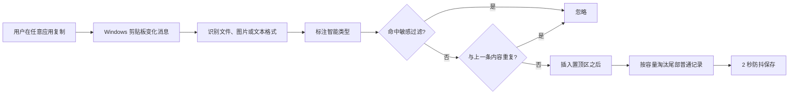
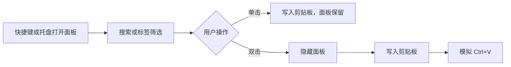
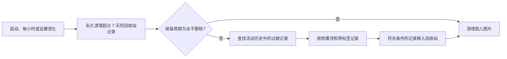

# ClipVault 产品逻辑说明

> 文档依据当前仓库源码整理，描述的是 **v1.0.0 当前实际行为**，不是未来规划。

## 1. 产品定位

ClipVault 是一个仅面向 Windows 的本地剪贴板历史管理工具。应用常驻系统托盘，持续记录系统剪贴板变化，并通过全局快捷键弹出历史面板，供用户搜索、分类、复制和再次粘贴。

核心目标：

- 自动保存近期复制过的文本、图片和文件。
- 快速检索并复用历史内容。
- 通过置顶和分组保留重要内容。
- 数据仅保存在本机用户目录。

## 2. 运行形态与生命周期

### 2.1 启动

1. 应用通过全局命名 Mutex 保证单实例运行。
2. 创建隐藏 Win32 消息窗口，用于接收剪贴板变化和全局热键消息。
3. 从本地磁盘加载设置、历史记录、图片和分组。
4. 注册剪贴板监听。
5. 注册全局快捷键，默认是 `Ctrl + Shift + V`。
6. 启动历史清理服务，启动时立即清理一次，之后每小时检查一次。
7. 创建但不主动显示历史面板，并创建系统托盘图标。

第二个实例启动时会直接退出，不会唤起已运行实例。

### 2.2 常驻与退出

- 关闭或隐藏历史面板不会退出应用，应用继续在托盘后台运行。
- 只能通过托盘菜单“退出”结束程序。
- 退出前会立即保存历史、注销热键、停止监听并释放托盘和单实例资源。

## 3. 用户入口

### 3.1 全局快捷键

- 默认快捷键：`Ctrl + Shift + V`。
- 快捷键用于切换历史面板的显示和隐藏。
- 连续触发有 1500ms 防抖，防止按键弹起或系统重复消息造成面板反复切换。
- 注册失败时提示快捷键可能被其他程序占用。

### 3.2 系统托盘

左键单击托盘图标：切换历史面板显示状态。

右键菜单提供：

- 显示剪贴板面板。
- 开启或关闭开机自启动。
- 打开设置。
- 查看版本信息。
- 退出应用。

### 3.3 历史面板

- 面板固定高 380 DIP，铺满当前屏幕工作区宽度，距屏幕底部 20 DIP。
- 优先显示在鼠标所在显示器；失败时回退到前台窗口或主工作区。
- 面板始终置顶，显示后自动聚焦并全选搜索框。
- 按 `Esc`、点击面板外部或再次触发快捷键会隐藏面板。
- 显示和隐藏分别有 150ms、120ms 淡入淡出动画。

## 4. 剪贴板采集逻辑

### 4.1 监听机制

应用使用 Windows `AddClipboardFormatListener` 监听 `WM_CLIPBOARDUPDATE`。每次剪贴板变化后读取当前内容，成功解析才生成历史记录。

应用自己向剪贴板写入历史内容时，会抑制下一次变化通知，避免产生回环记录。

### 4.2 格式识别优先级

同一份剪贴板数据可能包含多种格式，当前按以下顺序识别：

1. **文件列表**：存在文件拖放列表时直接记录为 Files。
2. **图片**：不存在文件列表但包含图片时记录为 Image。
3. **纯文本**：仅包含普通文本时记录为 Text，优先读取 UnicodeText。
4. **RTF**：包含 RTF 时记录为 Rtf，但业务内容只保存其纯文本表示。
5. **HTML**：包含 HTML 时记录为 Html，但业务内容只保存其纯文本表示。
6. **文本回退**：以上未命中时尝试读取任意文本。

无法识别或读取异常的内容不会进入历史。

记录进入历史前会执行智能类型识别和敏感内容过滤。智能类型只增强展示和搜索，不改变底层剪贴板格式；敏感过滤开启时，明显的密码、Token、私钥、身份证号和银行卡号不会保存。

### 4.3 各类型记录内容

| 类型 | 保存内容 | 预览 | 再次复制/粘贴 |
| --- | --- | --- | --- |
| Text | 纯文本 | 文本 | 纯文本 |
| Rtf | RTF 对应的纯文本 | 文本或剪贴板附带图片 | 纯文本，不恢复 RTF 格式 |
| Html | HTML 对应的纯文本 | 文本或剪贴板附带图片 | 纯文本，不恢复 HTML 格式 |
| Image | 位图 | 原图等比预览 | 图片 |
| Files | 文件路径列表 | 文件名；单个图片文件显示 200px 缩略图 | 文件拖放列表 |

支持识别为图片文件的扩展名：`.png`、`.jpg`、`.jpeg`、`.bmp`、`.gif`、`.ico`、`.tiff`、`.tif`、`.webp`。

### 4.4 智能类型

文本类记录会尝试识别以下智能类型：

- URL。
- Email。
- 手机号。
- JSON。
- SQL。
- 命令行。
- 代码片段。
- 颜色值。

文件和图片也会标注为文件、多文件或图片。智能类型会显示在卡片顶部，并参与搜索。

## 5. 历史记录规则

### 5.1 排序

- 置顶记录始终位于列表前部。
- 新记录插入到全部置顶记录之后，即非置顶区域的最前面。
- 新置顶的记录移动到整个列表首位。
- 取消置顶的记录移动到非置顶区域首位。
- 在“全部”视图双击粘贴一条记录后，该记录移动到对应区域最前面。
- 在某个标签筛选视图内粘贴不会调整全局顺序。

### 5.2 去重

当前只比较新记录与“最近一次接受的内容”的内容哈希，相同则忽略；不会扫描全部历史做全局去重。

哈希规则：

- Text、Rtf、Html：类型前缀加完整文本。
- Files：按文件路径及顺序拼接。
- Image：只使用图片宽度和高度。

因此，两张尺寸相同但内容不同的图片如果连续复制，第二张会被当作重复内容忽略。

### 5.3 容量

- 内存及历史上限为 500 条。
- 超出上限时从列表末尾开始删除非置顶记录。
- 如果全部记录都已置顶，允许实际数量超过 500 条。
- 置顶或带标签的记录不参与容量淘汰；如果剩余记录全部受保护，允许实际数量超过 500 条。

### 5.4 删除与清空

- 单条删除：从活动历史移入回收站，随后延迟持久化。
- “清空”只把所有非置顶记录移入回收站，置顶记录保留。
- 自动过期和容量淘汰的记录同样进入回收站。
- 回收站记录保留 7 天，可以恢复；永久删除和清空回收站需要确认。

## 6. 查找、筛选与列表加载

### 6.1 搜索

- 输入变化时实时搜索，不区分大小写。
- 搜索仅匹配 `PreviewText`。
- 文本、RTF、HTML 匹配纯文本内容。
- 文件匹配文件名，不匹配完整路径。
- 图片的可搜索文本固定为 `[图片]`。
- 标签文本和智能类型也参与搜索。
- 搜索条件和标签筛选同时存在时取交集。

### 6.2 标签筛选

- “全部”显示所有记录。
- 点击标签只显示包含该标签的记录。
- 再次点击当前标签会取消筛选。
- 当前筛选标签被删除后自动回到“全部”。

### 6.3 渐进加载

- 筛选结果不超过 15 条时一次显示全部。
- 超过 15 条时首屏加载 15 条。
- 横向滚动距末尾不足 500px 时，每次再加载 20 条。
- 鼠标滚轮转为横向滚动，卡片区也支持鼠标拖拽和惯性滑动。

## 7. 记录操作

### 7.1 单击复制（当前未接通）

ViewModel 和窗口层已经实现“单击卡片只复制、不隐藏面板、不自动粘贴”的命令与事件转发，但 `ClipboardItemCard` 当前没有在单击时触发 `ItemSelected` 事件。因此该能力在现有界面中实际不可用，用户可用的主要复用动作是双击自动粘贴。

如果该事件被触发，其底层复制规则为：

- 文本类优先使用 Win32 快速写入，最多尝试 3 次。
- 图片和文件列表使用 WPF Clipboard API。
- 写入失败时当前没有面向用户的错误提示。

### 7.2 双击粘贴

1. 立即隐藏面板。
2. 将选中记录写入系统剪贴板。
3. 等待约 250ms，让目标窗口恢复焦点，并为浏览器远程桌面的剪贴板同步留出时间。
4. 模拟 `Ctrl + V`，粘贴到此前获得焦点的目标应用。

只有成功写入剪贴板后才发送 `Ctrl + V`；写入失败时取消粘贴并向用户提示，避免粘贴剪贴板中的旧内容。

### 7.3 置顶

卡片悬停按钮或右键菜单可以切换置顶状态。置顶记录：

- 排在普通记录前面。
- 不参与自动过期清理。
- “清空”时保留。

### 7.4 编辑

- 仅 Text、Rtf、Html 类型显示“编辑”。
- 保存后直接替换该记录的文本内容并持久化。
- 图片和文件记录不可编辑。
- 编辑 Rtf/Html 只修改其纯文本表示。

### 7.5 多标签分组

用户可以：

- 在标签栏创建一个不关联记录的空分组。
- 给一条记录设置多个已有分组。
- 在记录右键菜单中新建分组并关联。
- 取消记录的单个分组，或清空全部分组。
- 删除分组。
- 拖拽调整标签显示顺序。

规则：

- 标签创建时去除首尾空白。
- 空标签或与现有独立标签、记录标签同名的标签不能创建。
- 标签匹配区分大小写。
- 弹窗输入多个标签时可用逗号、分号、竖线或换行分隔。
- 删除标签会从所有关联记录的 `Tags` 中移除该标签，不会删除记录。
- 只要记录包含至少一个标签，就不参与自动过期清理和容量淘汰。

## 8. 设置逻辑

### 8.1 开机自启动

- 设置页和托盘菜单都可以切换开机自启动。
- 通过当前用户注册表 `HKCU\\Software\\Microsoft\\Windows\\CurrentVersion\\Run` 实现，不要求管理员权限。
- 程序写入的启动命令带 `--minimized`，当前应用没有单独解析该参数；由于默认本来就不显示历史面板，实际仍表现为后台启动。

### 8.2 快捷键

- 用户点击“修改”后进入录制状态。
- 新快捷键必须至少包含 Ctrl、Shift、Alt、Win 中的一个修饰键。
- 只按修饰键不会完成录制，`Esc` 取消录制。
- 可以恢复默认 `Ctrl + Shift + V`。
- 新配置会先写入设置文件，再请求重新注册系统热键。
- 若新热键注册失败，设置文件仍保留该失败配置，下次启动会再次尝试注册。

### 8.3 自动清理周期

可选：

- 3 天。
- 7 天，默认值。
- 30 天。
- 90 天。
- 永不删除。

设置变更后立即执行一次清理检查。

设置页会基于当前历史数据展示清理预览，包括：

- 当前保留周期下会移入回收站的未置顶、未分组记录数量。
- 受置顶保护和分组保护的记录数量。
- 回收站中已超过 7 天、下次会被永久清理的记录数量。

如果切换到新的保留周期会立即影响活动历史，设置页会先弹出确认框；取消后保留原设置，不触发清理。

只有同时满足以下条件的记录才会被自动删除：

- 未置顶。
- 没有分组标签。
- 创建时间早于当前保留周期截止时间。

### 8.4 敏感内容过滤

设置页提供“敏感过滤”开关，默认开启。开启后，采集入口会跳过明显敏感的文本类剪贴板内容，包括：

- `password`、`token`、`secret`、`api_key` 等赋值形式。
- 私钥块。
- 常见访问令牌格式。
- 身份证号。
- 银行卡号。

过滤只作用于新采集内容，不会 retroactively 修改已经保存的历史。

### 8.5 导入导出

设置页提供数据导入和导出：

- 导出生成 `.zip`，包含 `history.json`、`settings.json`、最近 5 个历史快照和 `images/`。
- 导入前会预览备份包是否包含历史、设置和图片数量。
- 导入会覆盖当前本地数据；覆盖前会在 `%LocalAppData%\ClipVault\import-backups\` 自动导出一份当前数据。
- 导入后需要重启应用，运行中的内存历史不会自动热重载。

## 9. 数据持久化

### 9.1 数据位置

所有业务数据保存在：

```text
%LocalAppData%\ClipVault\
├── settings.json
├── history.json
├── history.json.bak1 ... history.json.bak5
├── import-backups\
└── images\
    └── {记录 Guid}.png
```

- `settings.json`：保留周期、快捷键和设置版本。
- `history.json`：记录元数据、文本、文件路径、置顶状态、多标签、智能类型、回收站及标签顺序。
- `images`：所有带图片预览的记录对应的 PNG，包括 Image、Rtf、Html 和单图片文件预览。

### 9.2 保存时机

- 历史或标签变化后采用 2 秒防抖保存，多次连续操作合并为一次磁盘写入。
- 应用正常退出时强制立即保存。
- 设置修改后立即保存。
- JSON 均先写临时文件，再替换正式文件，降低中途写入导致损坏的风险。
- 每次替换前轮转最近 5 个有效历史快照：`history.json.bak1` 至 `history.json.bak5`。

### 9.3 加载与降级

- 启动时先恢复置顶记录，再恢复普通记录。
- 主历史文件缺失或损坏时，依次尝试从 `bak1` 到 `bak5` 恢复。
- 图片记录对应文件丢失或损坏时，该记录降级为 Text。
- 单个图片文件记录如果本地源文件仍存在，会重新加载缩略图。
- 读取、写入和反序列化异常通常被静默忽略，应用继续运行。

### 9.4 图片清理

每次自动清理后，应用比较活动历史和回收站中的有效图片 ID，删除 `images` 目录中不再被任何记录引用的 PNG。

### 9.5 卸载

安装器卸载时会：

- 强制结束正在运行的 `ClipVault.exe`。
- 删除安装目录。
- 删除 `%LocalAppData%\ClipVault` 下的全部历史、设置和图片。

因此卸载是彻底清除用户数据，不提供保留数据选项。

## 10. 核心业务数据模型

单条历史记录 `ClipboardItem` 包含：

| 字段 | 含义 |
| --- | --- |
| Id | 记录唯一标识，Guid |
| Type | Text、Image、Files、Rtf、Html 或 Other |
| Text | 文本类内容 |
| Image | 图片或预览图 |
| FilePaths | 文件路径列表 |
| CapturedAt | 首次采集时间 |
| IsPinned | 是否置顶 |
| Tags | 多个分组标签，空表示未分组 |
| Tag | 兼容旧数据和旧代码的首个标签映射 |
| SmartType | 智能类型识别结果 |

一条记录可以属于多个标签。

## 11. 端到端业务流程

### 11.1 自动采集



### 11.2 历史复用



### 11.3 自动清理



## 12. 当前边界与风险点

以下是现有实现的明确边界，测试和需求变更时应重点关注：

1. 产品仅支持 Windows，依赖 WPF、Win32 消息、注册表和模拟键盘输入。
2. 不支持云同步、账号、多设备或数据加密；导入导出是本地 zip 全量覆盖模式。
3. 不保留 RTF/HTML 原始格式，再次粘贴只有纯文本。
4. 图片去重仅依据尺寸，存在误判。
5. 文件记录保存的是原始绝对路径；源文件移动或删除后，再次粘贴可能无效。
6. 单击复制的 ViewModel 和窗口层已实现，但卡片单击事件仍未接通。
7. 敏感内容过滤基于本地规则，可能漏判或误判。
8. 导入后需要重启应用，当前运行内存不会立即反映导入数据。
9. 多数磁盘、注册表和剪贴板异常被静默处理，用户不一定能感知失败。
10. 关闭第二实例不会通知或唤醒第一实例。
11. 卸载会删除全部本地数据，且安装脚本使用强制结束进程。

## 13. 代码职责索引

| 模块 | 主要职责 |
| --- | --- |
| `App.xaml.cs` | 应用启动、服务编排、热键、托盘、退出 |
| `ClipboardFormatDetector` | 剪贴板格式识别和内容提取 |
| `ClipboardMonitor` | 监听变化及写入回环抑制 |
| `ClipboardStore` | 排序、去重、容量、置顶、多标签、编辑、保存调度 |
| `PersistenceService` | 历史 JSON 和图片读写 |
| `ImportExportService` | 本地 zip 导入导出和导入前自动备份 |
| `SensitiveContentFilter` | 敏感文本识别和跳过保存 |
| `SmartContentClassifier` | 智能类型识别 |
| `CleanupService` | 周期过期清理和孤儿图片清理 |
| `SettingsService` | 设置加载、更新和保存 |
| `HotkeyService` | 全局热键注册与注销 |
| `PopupViewModel` | 搜索、筛选、分页及记录操作命令 |
| `PopupWindow` | 面板显示、多屏定位、滚动、拖拽和自动粘贴 |
| `ClipboardItemCard` | 单条记录展示、右键菜单、编辑和标签入口 |
| `SettingsWindow` | 自启动、热键录制、清理周期、敏感过滤、导入导出 |
| `ClipVaultSetup.iss` | 安装、启动项、卸载和数据清理 |
